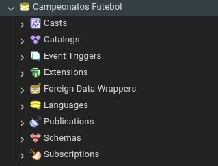
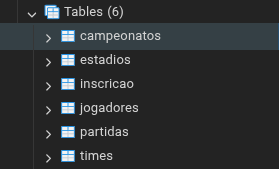
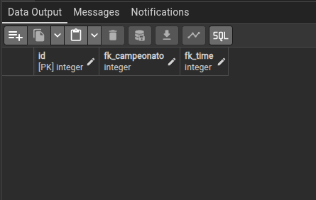
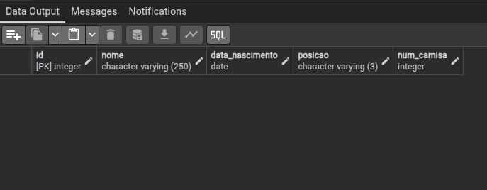
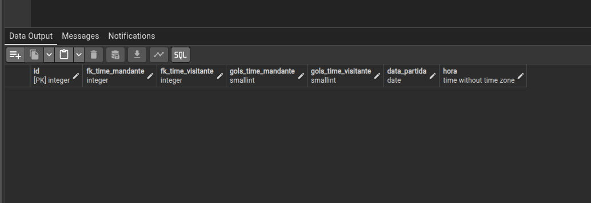
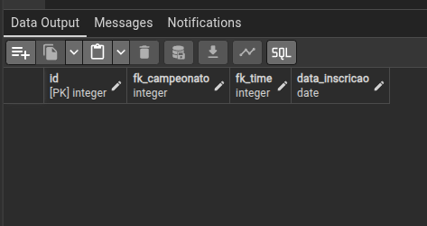
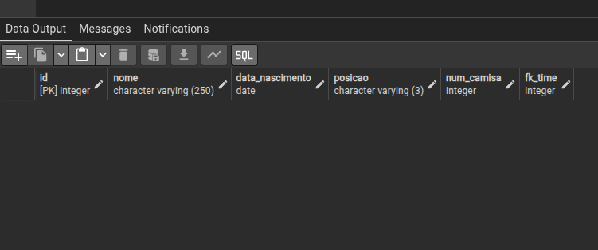
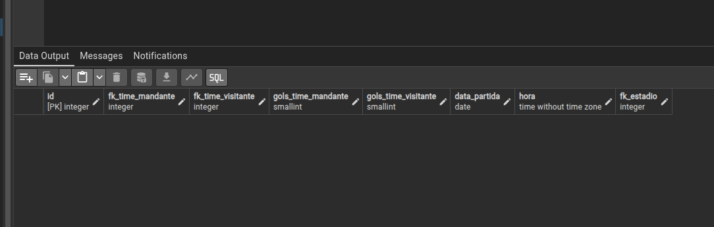

# Modelagem e Criação de Banco de Dados
Nome do aluno: Francisco Felipe  
Disciplina: Introdução à Banco de Dados  
Professor: Anderson Soares

# Descrição
Esse projeto cria e configura umas estrutura de banco de dados para um sistema de campeonatos de futebol.

# Modelo

# Tabelas
- Campeonatos
- Times
- Inscricao
- Partidas
- Estadios
- Jogadores

# Tecnologias utilizadas
- PostgreSQL
- PgAdmin
- Git
- GitHub

# Evidências
## Criação do banco  

## Criação das tabelas  

## Tabelas antes da alteração
  
  
  

## Tabelas após a alteração
  
  
  